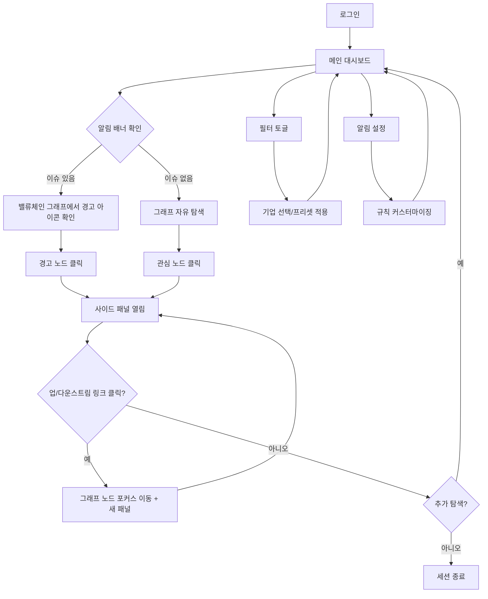

# Memory SCM Intelligence Platform - 사용자 플로우

## 1. 메인 플로우

## 2. 화면별 플로우

### 화면 1: 로그인 (/login)
- **진입**: URL 직접 접근 또는 미인증 리다이렉트
- **행동**: 이메일/비밀번호 입력 → 로그인
- **이탈**: 인증 성공 → 메인 대시보드

### 화면 2: 메인 대시보드 (/dashboard)
- **진입**: 로그인 후 자동 이동
- **행동**:
  - 알림 배너 확인
  - 밸류체인 동적 그래프 탐색 (zoom in/out)
  - 병목 경고 아이콘 확인
  - 필터 토글로 기업 필터링
- **이탈**: 노드 클릭 → 사이드 패널 / 설정 이동

### 화면 3: 사이드 패널 (노드 클릭 시)
- **진입**: 그래프 노드 클릭
- **행동**:
  - 기업/클러스터 상세 정보 확인
  - 이슈 요약 + 관련 뉴스 헤드라인 확인
  - 업/다운스트림 링크 클릭 → 그래프 노드 포커스 이동
- **이탈**: 패널 닫기 / 다른 노드 클릭 / 링크 클릭

### 화면 4: 필터 오버레이 패널 (토글 시)
- **진입**: 대시보드 필터 토글 버튼 클릭
- **행동**:
  - 기업 체크박스 선택/해제
  - 프리셋 선택 (상위 100개, 메모리사만 등)
  - 기업명 검색
- **이탈**: 적용 → 그래프 업데이트 / 토글 닫기

### 화면 5: 알림 설정 (/settings/alerts)
- **진입**: 대시보드 설정 메뉴
- **행동**:
  - 알림 규칙 추가/수정/삭제
  - 병목 감지 임계값 설정
  - 알림 채널 설정 (이메일, 인앱)
- **이탈**: 저장 → 대시보드

## 3. 예외 플로우

- **로그인 실패**: 에러 메시지 표시, 재시도
- **네트워크 에러**: 오프라인 배너 표시, 마지막 캐시 데이터 유지
- **데이터 로딩 지연**: 스켈레톤 UI 표시
- **그래프 노드 과다 (성능)**: 자동 클러스터링, 줌 레벨에 따라 상세도 조절
