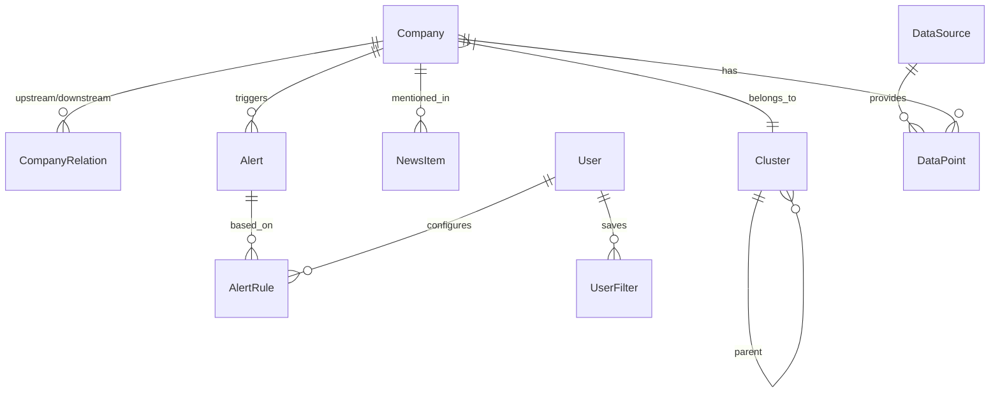

# Memory SCM Intelligence Platform - 데이터베이스 설계

## 1. ERD

## 2. 테이블 정의

### companies (기업)
| 컬럼 | 타입 | 제약 | 설명 |
|------|------|------|------|
| id | int | PK | 기본키 |
| name | varchar(255) | NOT NULL, UNIQUE | 기업명 |
| name_kr | varchar(255) | | 기업명 (한국어) |
| cluster_id | int | FK → clusters.id | 소속 클러스터 |
| tier | varchar(50) | | 밸류체인 위치 (raw_material, equipment, fab, packaging, module) |
| country | varchar(100) | | 소재 국가 |
| description | text | | 기업 설명 |
| metadata | json | | 추가 메타데이터 |
| created_at | datetime | NOT NULL | 생성일 |
| updated_at | datetime | NOT NULL | 수정일 |

### clusters (클러스터)
| 컬럼 | 타입 | 제약 | 설명 |
|------|------|------|------|
| id | int | PK | 기본키 |
| name | varchar(255) | NOT NULL | 클러스터명 (원자재, 장비사 등) |
| parent_id | int | FK → clusters.id, NULLABLE | 상위 클러스터 |
| tier | varchar(50) | NOT NULL | 밸류체인 위치 |

### company_relations (기업 간 관계)
| 컬럼 | 타입 | 제약 | 설명 |
|------|------|------|------|
| id | int | PK | 기본키 |
| source_id | int | FK → companies.id | 공급사 |
| target_id | int | FK → companies.id | 수요사 |
| relation_type | varchar(50) | NOT NULL | supplier, customer, partner |
| strength | float | | 관계 강도 (0-1) |
| metadata | json | | 추가 정보 |

### alerts (알림)
| 컬럼 | 타입 | 제약 | 설명 |
|------|------|------|------|
| id | int | PK | 기본키 |
| company_id | int | FK → companies.id | 관련 기업 |
| severity | varchar(20) | NOT NULL | critical, warning, info |
| title | varchar(500) | NOT NULL | 알림 제목 |
| description | text | | 알림 상세 |
| is_read | boolean | DEFAULT false | 읽음 여부 |
| created_at | datetime | NOT NULL | 생성일 |

### alert_rules (알림 규칙)
| 컬럼 | 타입 | 제약 | 설명 |
|------|------|------|------|
| id | int | PK | 기본키 |
| user_id | int | FK → users.id | 설정한 사용자 |
| name | varchar(255) | NOT NULL | 규칙명 |
| condition | json | NOT NULL | 조건 (JSON 형태) |
| is_active | boolean | DEFAULT true | 활성 여부 |

### news_items (뉴스)
| 컬럼 | 타입 | 제약 | 설명 |
|------|------|------|------|
| id | int | PK | 기본키 |
| title | varchar(500) | NOT NULL | 뉴스 제목 |
| url | varchar(1000) | NOT NULL | 원문 링크 |
| source | varchar(255) | | 출처 |
| company_id | int | FK → companies.id, NULLABLE | 관련 기업 |
| published_at | datetime | | 발행일 |
| created_at | datetime | NOT NULL | 수집일 |

### data_sources (데이터 소스)
| 컬럼 | 타입 | 제약 | 설명 |
|------|------|------|------|
| id | int | PK | 기본키 |
| name | varchar(255) | NOT NULL | 소스명 |
| type | varchar(50) | NOT NULL | api, crawl, manual |
| config | json | | 소스 설정 |
| is_active | boolean | DEFAULT true | 활성 여부 |

### data_points (데이터 포인트)
| 컬럼 | 타입 | 제약 | 설명 |
|------|------|------|------|
| id | int | PK | 기본키 |
| source_id | int | FK → data_sources.id | 데이터 소스 |
| company_id | int | FK → companies.id, NULLABLE | 관련 기업 |
| metric | varchar(100) | NOT NULL | 지표명 (price, inventory, lead_time) |
| value | float | NOT NULL | 값 |
| unit | varchar(50) | | 단위 |
| timestamp | datetime | NOT NULL | 시점 |

### users (사용자)
| 컬럼 | 타입 | 제약 | 설명 |
|------|------|------|------|
| id | int | PK | 기본키 |
| email | varchar(255) | NOT NULL, UNIQUE | 이메일 |
| hashed_password | varchar(255) | NOT NULL | 해시된 비밀번호 |
| name | varchar(255) | | 사용자명 |
| role | varchar(50) | DEFAULT 'viewer' | admin, analyst, viewer |
| created_at | datetime | NOT NULL | 가입일 |

### user_filters (사용자 필터 프리셋)
| 컬럼 | 타입 | 제약 | 설명 |
|------|------|------|------|
| id | int | PK | 기본키 |
| user_id | int | FK → users.id | 사용자 |
| name | varchar(255) | NOT NULL | 프리셋명 |
| company_ids | json | NOT NULL | 선택된 기업 ID 목록 |
| is_default | boolean | DEFAULT false | 기본 필터 여부 |

## 3. 인덱스

- `companies.name` (기업명 검색)
- `companies.cluster_id` (클러스터별 조회)
- `companies.tier` (밸류체인 위치별 조회)
- `company_relations.source_id, target_id` (관계 조회)
- `alerts.company_id, created_at` (기업별 최신 알림)
- `alerts.severity, is_read` (미읽은 중요 알림)
- `data_points.company_id, metric, timestamp` (시계열 조회)
- `news_items.company_id, published_at` (기업별 최신 뉴스)

## 4. 제약 조건

- **Foreign Key**: 모든 FK에 ON DELETE CASCADE 또는 SET NULL 적용
- **Unique**: companies.name, users.email
- **Check**: alerts.severity IN ('critical', 'warning', 'info')
